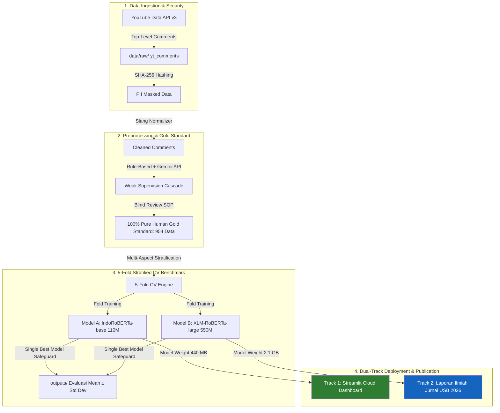

# PRD.md — Product Requirements Document

## Dokumen Kontrol & Pelacakan Versi

| Atribut | Detail |
|---|---|
| **Versi Dokumen** | **v2.0 (Final Sprint-Ready)** |
| **Tanggal Pembaruan** | 27 September 2026 |
| **Penulis / Lead** | Wicaksono Hanif Supriyanto & Firman Pambudiansyah |
| **Target Reviewer** | Dewan Juri USB 2026, Dosen Pembimbing, & Peer Reviewer Jurnal |
| **Status Dokumen** | **Disetujui untuk Eksekusi Sprint (Approved)** |

### Cover Note untuk Reviewer
> Dokumen PRD v2.0 memuat pembaruan krusial hasil evaluasi literatur dan audit risiko teknis dari Iterasi 01:
> 1. **Mitigasi OOM Deployment:** Membatasi model *web deployment* Streamlit Cloud hanya untuk **IndoRoBERTa-base (110M / ~440 MB)** karena batas memori RAM server gratis adalah 1 GB. Model **XLM-RoBERTa-large (550M / ~2.1 GB)** diposisikan eksklusif untuk benchmark riset publikasi jurnal.
> 2. **Mitigasi Bias Audit Manusia:** Mengadopsi temuan Schroeder et al. (2025) dengan mewajibkan protokol *Blind Review* pada sisa data audit (`human_audit_remaining.xlsx`). Label prediksi AI (Gemini) disembunyikan agar anotator manusia independen dan tidak terdikte sugesti model.
> 3. **Mitigasi Disk Limit & Benchmark Valid:** Mengadopsi 5-Fold Stratified Cross-Validation dengan pelaporan statistik *Mean ± Std Dev*, dipadukan fitur *Single Best Model Safeguard* untuk mencegah diska Kaggle penuh.

### Riwayat Perubahan (Changelog)
| Versi | Tanggal | Inisiator | Ringkasan Perubahan |
|---|---|---|---|
| v1.0 | 10 September 2026 | Tim USB 2026 | Rilis inisial: evaluasi single split 70/30, ekstraksi YouTube API, pipeline baseline. |
| v2.0 | 27 September 2026 | Spesialis PM | Integrasi mitigasi risiko literatur: Blind Review SOP, isolasi deployment IndoRoBERTa vs XLM-RoBERTa, 5-Fold Stratified CV, format WBS dengan Definition of Done (DoD) terukur. |

---

## 1. Executive Summary & Context
* **Nama Proyek:** Aspect-Based Sentiment Analysis (ABSA) Multi-Task Mobil Listrik (EV) China di Indonesia.
* **Target Kompetisi / Tujuan:** Lomba Penambangan Data USB 2026 & Publikasi Jurnal Terakreditasi SINTA / Internasional.
* **Tema Kompetisi:** *Ekosistem Digital Cerdas untuk Masa Depan Indonesia yang Inklusif dan Berkelanjutan*.
* **Batas Waktu Akhir:** 5 Oktober 2026.
* **Pernyataan Masalah:** Penetrasi kendaraan listrik pabrikan China (BYD, Wuling, Chery, Neta, Seres) membuka mobilitas hijau terjangkau di Indonesia. Namun adopsi massal terhambat keraguan publik seputar durabilitas baterai, depresiasi harga purnajual, dan kesiapan infrastruktur SPKLU. Opini YouTube sangat kaya informasi tetapi memiliki ketimpangan kelas (*class imbalance*) ekstrem (kelas `None` >80%, sementara kelas minoritas seperti `purnajual positif` sangat langka) serta penggunaan bahasa slang informal yang tinggi.
* **Solusi yang Diajukan:**
  1. Pipeline ekstraksi beretika (YouTube API v3 + SHA-256 PII Masking) dipadukan *Hybrid Weak Supervision* (Rule-based + Gemini API) dan audit manusia berbasis *Blind Review* menghasilkan *100% Pure Human Gold Standard Dataset* (954 baris).
  2. Komparasi ilmiah arsitektur *Discriminative Encoder*: IndoRoBERTa-base (110M Monolingual) vs XLM-RoBERTa-large (550M Multilingual) menggunakan Multi-Task GELU MLP Classifier Heads, Multi-Aspect Focal Loss ($\gamma = 1.5$), Smoothed Class Weights, dan Aspect-Specific Thresholding.
  3. Evaluasi ketat 5-Fold Stratified Cross-Validation dengan *Single Best Model Storage Safeguard* di Kaggle T4 GPU.
  4. Deployment dasbor interaktif $0 operational cost via Streamlit Community Cloud (menggunakan IndoRoBERTa-base) dan repositori publik di Hugging Face Hub.

---

## 2. Tujuan & Metrik Keberhasilan (KPIs)

### A. Sasaran Riset & Kompetisi
* **G-1:** Menghasilkan korpus data sentimen 4 aspek otomotif EV pertama di Indonesia yang terverifikasi 100% audit manusia (*zero data leakage*, bebas bias AI).
* **G-2:** Membuktikan secara empiris efektivitas model Monolingual vs Multilingual Large pada teks informal YouTube warganet Indonesia.
* **G-3:** Menyelesaikan masalah degradasi performa pada kelas minoritas aktif melalui Focal Loss, pembobotan dinamis, dan augmentasi kontekstual terarah.
* **G-4:** Meluncurkan dasbor analitik publik interaktif untuk memberi rekomendasi kebijakan bagi regulator (Kemenhub/ESDM) dan pelaku industri APM EV.

### B. Metrik Kuantitatif & Capaian Benchmark

| Dimensi | Metrik Sukses | Target Nilai | Capaian Iterasi 01 (XLM-RoBERTa) | Status | Acceptance Criteria / DoD |
|---|---|---|---|---|---|
| **Data Quality** | Inter-Annotator Agreement | $\kappa \ge 0,61$ (*Substantial*) | Validasi Manusia 100% (954 sampel) | 🟢 Tercapai | Lolos audit *Blind Review* tanpa kebocoran label model. |
| **Overall Accuracy** | Mean Accuracy 4 Aspek | $> 80,0\%$ | **85,45%** | 🟢 Tercapai | Evaluasi 5-Fold CV menghasilkan rata-rata $> 80\%$. |
| **Macro F1 (All-Class)** | Mean Macro F1 4 Aspek | $> 60,0\%$ | **62,92%** | 🟢 Tercapai | Mengukur seluruh kelas termasuk mayoritas `None`. |
| **Macro F1 (Active)** | Mean Macro F1 Sentimen Aktif | $> 50,0\%$ | **52,81%** | 🟢 Tercapai | Evaluasi eksklusif pada kelas `positif`, `netral`, `negatif`. |
| **Subset Accuracy** | Exact Match Ratio 4 Aspek | $> 50,0\%$ | **55,40%** | 🟢 Tercapai | Prediksi ke-4 aspek tepat secara simultan pada data validasi. |
| **Inference Cost** | Hosting & API Budget | **Rp0 ($0)** | 100% Free Tier (Kaggle + Streamlit) | 🟢 Tercapai | Tidak ada tagihan berbayar selama masa siklus proyek. |
| **Web Stability** | Memory Footprint (RAM) | $< 1.0\text{ GB}$ | Belum rilis web (Ukuran XLM 2.1 GB rentan crash) | 🟡 In-Progress | Dashboard wajib hanya me-load IndoRoBERTa (~440 MB). |

---

## 3. Arsitektur Sistem & Spesifikasi Tech Stack

### A. Diagram Alur Sistem (End-to-End Pipeline)

### B. Spesifikasi Tech Stack per Lapisan

| Layer / Modul | Teknologi Terpilih | Justifikasi & Peran Spesifik |
|---|---|---|
| **Bahasa Utama** | Python $\ge 3.10$ | Standar eksekusi skrip data, model, dan pipeline analitik. |
| **Ingestion & Keamanan** | `google-api-python-client`, `hashlib` | Ekstraksi resmi YouTube API v3 dan anonimisasi data PII via SHA-256. |
| **Data Cleaning** | `pandas`, `re`, `json` | Normalisasi slang otomotif lokal (`data/slang_dict.json`) & reduksi *noise*. |
| **Weak Supervision** | Google Gemini API (`gemini-1.5-flash`) | Anotasi teks ambigu via Structured JSON Output ($0 cost / free tier). |
| **Deep Learning & Modeling** | PyTorch, Hugging Face `transformers` | Multi-Task GELU MLP Heads, IndoRoBERTa (110M), XLM-RoBERTa (550M). |
| **Loss & Evaluator** | `scikit-learn`, Custom Focal Loss | Multi-Aspect Focal Loss ($\gamma = 1.5$), Smoothed Weights, dan evaluasi 5-Fold. |
| **Lingkungan Komputasi** | Kaggle Notebooks (NVIDIA T4 16GB) | Eksekusi training 5-Fold Cross-Validation tanpa biaya infrastruktur. |
| **Visualisasi & Web UI** | Streamlit Community Cloud, Plotly | Dasbor sentimen interaktif & *inference playground* real-time (RAM <1 GB). |
| **Model Registry** | Hugging Face Hub | Penyimpanan artefak publik bobot model PyTorch & tokenizer. |

---

## 4. Persyaratan Fungsional (FR) & Definition of Done (DoD)

### FR-1: Akuisisi Data & Kepatuhan Etika
* **Deskripsi:** Ekstraksi komentar warganet dari video review EV China secara legal dan aman.
* **Definition of Done (DoD):**
  - Menggunakan API resmi YouTube tanpa unauthorized web scraping.
  - Kuota API terjaga $< 10.000$ unit per hari.
  - Seluruh identitas pengguna (`authorDisplayName`, `authorChannelId`) dienkripsi permanen menggunakan hash SHA-256 (`user_id_hash`).
  - Berkas `data/raw/` bersifat *read-only* (immutable).

### FR-2: Prapemrosesan, Weak Supervision, & Audit Blind Review
* **Deskripsi:** Pembersihan teks slang, pelabelan otomatis awal, dan validasi manual bebas bias.
* **Definition of Done (DoD):**
  - Normalisasi slang otomotif lokal menggunakan kamus `data/slang_dict.json`.
  - Pelabelan *Weak Supervision* berbasis *cascade* (Rule-based lokal + Gemini API Structured JSON).
  - Validasi manual 100% pada 954 sampel menerapkan protokol **Blind Review** (kolom tebakan AI disembunyikan agar anotator tidak mengalami *anchor bias*).
  - Skor kesepakatan Cohen's Kappa tercatat $\kappa \ge 0,61$.

### FR-3: Benchmark Model 5-Fold Stratified Cross-Validation & Augmentasi
* **Deskripsi:** Pelatihan komparatif multi-task 4 aspek pada IndoRoBERTa-base vs XLM-RoBERTa-large.
* **Definition of Done (DoD):**
  - Implementasi 5-Fold Stratified Cross-Validation komposit 4 aspek tanpa kebocoran data (*zero data leakage*, seed=42).
  - Mengaktifkan *Single Best Model Storage Safeguard* di Kaggle: hanya menyimpan 1 file bobot model terbaik untuk mencegah galat diska penuh (/kaggle/working < 20 GB).
  - Menerapkan *Multi-Aspect Focal Loss* ($\gamma = 1.5$), Smoothed Class Weights ($\sqrt{w}$), dan *Aspect-Specific Thresholding* ($\theta_{\text{purnajual}}=0.35, \theta_{\text{infra}}=0.40, \theta_{\text{ekonomi}}=0.50, \theta_{\text{kualitas}}=0.50$).
  - Modul augmentasi teks kontekstual (jika diaktifkan) **hanya diaplikasikan pada fold pelatihan (train fold)** dan dilarang menyentuh fold validasi.
  - Seluruh metrik dilaporkan dalam format statistik ilmiah *Mean ± Standard Deviation*.

### FR-4: Streamlit Web Dashboard & Policy Insights
* **Deskripsi:** Penyediaan antarmuka dasbor interaktif berbasis web untuk visualisasi sentimen dan uji inferensi real-time.
* **Definition of Done (DoD):**
  - **Memory Guardrail:** Model inferensi dasbor wajib menggunakan **IndoRoBERTa-base (110M / ~440 MB)** untuk menjamin konsumsi RAM $< 1\text{ GB}$ pada Streamlit Community Cloud.
  - Terdapat tab visualisasi sebaran sentimen per aspek (Plotly charts interaktif).
  - Terdapat tab *Live Inference Playground* yang menerima teks baru dan mengeluarkan prediksi 4 aspek beserta skor probabilitas secara instan ($< 2$ detik).
  - Biaya operasional hosting Rp0 (100% free tier).

---

## 5. Agile Project Charter, WBS, & Alokasi Tim

### Jadwal Sprint & Work Breakdown Structure (WBS)
| Sprint # | Task ID | Deskripsi Pekerjaan | Assignee | Est. Hari | Status | Dependensi |
|---|---|---|---|---|---|---|
| Sprint 1 | DATA-01 | Selesaikan validasi *Blind Review* sisa audit data di `human_audit_remaining.xlsx` | `spesialis-research-akademik` | 1 Hari | Ready | - |
| Sprint 1 | ML-01 | Buat modul augmentasi sinonim kontekstual minoritas pada *train set* | `spesialis-data-ai-agentic` | 1 Hari | Ready | DATA-01 |
| Sprint 1 | ML-02 | Eksekusi 5-Fold CV IndoRoBERTa & XLM-RoBERTa + Single Best Checkpoint di Kaggle | `spesialis-data-ai-agentic` | 2 Hari | Todo | ML-01 |
| Sprint 2 | DEV-01 | Bangun web dashboard Streamlit teroptimasi RAM (<1GB) dengan IndoRoBERTa | `spesialis-frontend` | 2 Hari | Todo | ML-02 |
| Sprint 2 | OPS-01 | Unggah model IndoRoBERTa dan XLM-RoBERTa ke Hugging Face Hub | `spesialis-devops-infrastruktur` | 1 Hari | Todo | ML-02 |
| Sprint 3 | DOC-01 | Tulis draf akhir proposal & laporan penelitian USB 2026 di folder `journal/` | `spesialis-research-akademik` | 3 Hari | Todo | DEV-01, OPS-01 |

### Alokasi Anggaran & Sumber Daya ($0 Budget)
| Komponen / Alat | Porsi Alokasi | Biaya | Batasan & Kontrak Operasional |
|---|---|---|---|
| **Kaggle T4 GPU** | 100% Training | Rp0 | Maksimum 30 jam GPU per minggu; gunakan batch size 16 dan gradient accumulation. |
| **Streamlit Community Cloud** | 100% Web Hosting | Rp0 | Batas RAM 1 GB; dilarang memuat model XLM-RoBERTa. |
| **Hugging Face Hub** | Model Storage | Rp0 | Repositori publik untuk bobot model PyTorch & tokenizer. |
| **YouTube Data API v3** | Data Ingestion | Rp0 | Menjaga kuota harian di bawah 10.000 unit. |

### Matriks Risiko & Mitigasi Aktif
| Kode Risiko | Deskripsi Risiko | Probabilitas | Dampak | Strategi Mitigasi Terpilih |
|---|---|---|---|---|
| **RSK-01** | Server Streamlit OOM Crash (Model 2.1 GB) | Sangat Tinggi | Kritis | Isolasi arsitektur: hanya deploy IndoRoBERTa-base (~440 MB) ke Streamlit. |
| **RSK-02** | Diska Kaggle Penuh saat 5-Fold CV (11 GB checkpoint) | Tinggi | Kritis | Terapkan *Single Best Model Storage Safeguard* (hanya 1 checkpoint terbaik disimpan). |
| **RSK-03** | Bias Anotasi Akibat Saran LLM (Gemini) | Tinggi | Sedang | Terapkan protokol *Blind Review* pada audit manusia sisa dataset. |
| **RSK-04** | Semantic Drift akibat Augmentasi Teks | Sedang | Sedang | Batasi sinonim menggunakan `data/slang_dict.json` khusus istilah otomotif lokal. |
| **RSK-05** | Performa F1 Kelas Minoritas Rendah | Menengah | Tinggi | Kombinasi Multi-Aspect Focal Loss ($\gamma = 1.5$) + Threshold dinamis $\theta_{\text{purnajual}} = 0.35$. |
